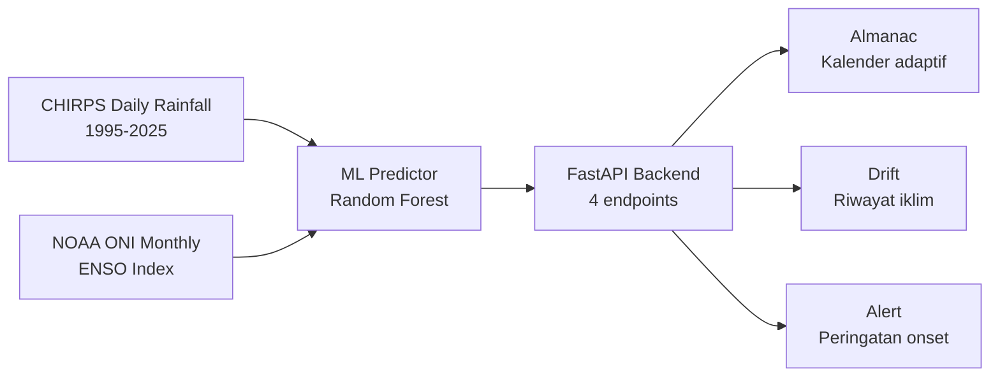

# Mangsakala
> Kalender Iklim Adaptif untuk Pertanian Berbasis Kearifan Lokal

[]()
[]()
[]()

## Tentang Proyek

Mangsakala mengalibrasi ulang kalender Pranata Mangsa Jawa terhadap anomali iklim modern, menggunakan machine learning untuk membantu petani tradisional beradaptasi dengan dampak perubahan iklim.

Pendekatan **Two-Eyed Seeing**: mengawinkan sains iklim modern dengan kearifan lokal.

| Mata Kiri (Modern) | Mata Kanan (Lokal) |
|---|---|
| Data CHIRPS rainfall + NOAA ONI | Siklus 12 Mangsa Pranata Mangsa |
| Random Forest ML predictor | Tanda alam, ritme musim Jawa |
| Prediksi onset berbasis ENSO | Kapat–Kalima sebagai patokan tanam |

## Masalah

- **97%** petani tradisional Kebumen kesulitan memprediksi musim tanam
- Akurasi Pranata Mangsa turun ke **66.7%** (data 2023)
- Penundaan tanam 30 hari → kerugian produksi padi **6.5–11% nasional**
- Penyebab utama: kalender tradisional tidak mengakomodasi drift iklim yang kini mencapai **+5.2 hari/dekade**

## Solusi

Sistem tiga layar yang bisa diakses dari browser:

1. **Almanac** — Kalender 12 mangsa adaptif vs tradisional, jendela tanam yang dipersonalisasi
2. **Drift** — Visualisasi pergeseran onset hujan 1995–2025 dan konteks ENSO
3. **Alert** — Peringatan onset dengan rekomendasi tindakan berbahasa Indonesia

## Arsitektur



**Data flow:**
- CHIRPS: Curah hujan harian Kebumen, resolusi 5.5km, 1995–2025
- NOAA ONI: Indeks ENSO bulanan (DJF, JFM, … NDJ)
- Features: `oni_jjas_avg`, `oni_lag_3`, `pre_season_rainfall`, `prev_onset_doy`
- Output: Prediksi onset DOY, pergeseran vs Pranata Mangsa, rekomendasi tanam

## Tech Stack

| Layer | Teknologi |
|---|---|
| Frontend | React 18 (CDN), Babel Standalone, vanilla CSS |
| Backend | FastAPI, Pydantic v2, Uvicorn |
| ML | scikit-learn Random Forest, pandas, numpy |
| Data | CHIRPS (UCSB), NOAA Climate Prediction Center |

## Instalasi

### Prasyarat
- Python 3.11+
- Git

### Backend

```bash
git clone https://github.com/<username>/mangsakala-mvp.git
cd mangsakala-mvp/backend

python -m venv venv
venv\Scripts\activate          # Windows
# source venv/bin/activate     # macOS/Linux

pip install -r requirements.txt
uvicorn main:app --reload --port 8000
```

API tersedia di `http://localhost:8000/api`

### Frontend

Frontend adalah file HTML statis — tidak butuh build step atau npm.

Buka salah satu cara berikut:
```bash
# Opsi 1: Python static server (dari folder frontend/)
cd frontend
python -m http.server 3000

# Opsi 2: Langsung buka di browser
# Klik kanan Mangsakala-Almanac.html → Open with Browser
```

Akses di `http://localhost:3000/Mangsakala-Almanac.html`

### Endpoints Backend

| Method | Path | Keterangan |
|---|---|---|
| `GET` | `/api/calendar` | Kalender 12 mangsa + jendela tanam |
| `GET` | `/api/alert` | Status peringatan onset + ENSO |
| `GET` | `/api/drift` | Tren pergeseran onset 1995–2025 |
| `GET` | `/api/health` | Status server dan model |

## Metodologi

### Deteksi Onset
Simplified Liebmann-Marengo: onset didefinisikan sebagai hari pertama akumulasi curah hujan mencapai threshold setelah minggu kering terakhir di awal musim.

### Model ML
- **Algoritma:** Random Forest Regressor (100 estimators, max\_depth=5)
- **Features:** ONI Jun–Sep rata-rata, ONI lag 3 bulan (Jul–Sep), total curah hujan pra-musim (Jul–Sep), onset tahun sebelumnya
- **Validasi:** Leave-One-Out CV pada n=30 onset event 1995–2025
- **Output:** Prediksi onset DOY, diklem ke rentang [260, 340]

## Hasil

| Metrik | Nilai |
|---|---|
| MAE Model | **9.2 hari** |
| MAE Pranata Mangsa (baseline) | 12.0 hari |
| Peningkatan akurasi | ~23% lebih akurat dari baseline tradisional |
| Performa terbaik | Tahun ENSO netral |
| Performa terlemah | El Niño kuat (n=4 dalam training) |

Tren iklim: onset hujan bergeser rata-rata **+7.3 hari** dari patokan Pranata Mangsa (rata-rata 30 tahun), dengan laju **+5.2 hari/dekade**.

## Keterbatasan & Transparansi

- Training data terbatas: n=30 onset event (satu per tahun, 1995–2025)
- Validasi single-region: hanya Kebumen, Jawa Tengah
- Resolusi CHIRPS 5.5km — bisa melewatkan variasi mikro-iklim
- Belum mengintegrasikan IOD (Indian Ocean Dipole)
- Simplified Liebmann-Marengo — bukan implementasi penuh dari paper asli
- Wilayah lain (Sleman, Bantul, Klaten, Magelang, Karanganyar) belum tersedia data

## Roadmap

| Fase | Waktu | Target |
|---|---|---|
| Phase 1 | 0–12 bulan | Validasi multi-wilayah Jawa Tengah & DIY |
| Phase 2 | 1–3 tahun | Integrasi dengan Dinas Pertanian Jateng |
| Phase 3 | 3+ tahun | Platform kalender adat Asia: Subak Bali, Bugis, Sasi Maluku |

## Tim

| Nama | Peran |
|---|---|
| Satya | Frontend & Production Lead |
| Reza Dwi Pranata | Backend & ML Lead |
| Azzaenab | Data & Penelitian |
| Nadya | Komunikasi & Validasi Lapangan |

## Lisensi

MIT — lihat [LICENSE](LICENSE)

## Ucapan Terima Kasih

- **IYREF 2026 SRE ITB** — kompetisi yang mendorong proyek ini
- **CHIRPS / UCSB Climate Hazards Center** — data curah hujan harian
- **NOAA Climate Prediction Center** — data ENSO (ONI monthly)
- Para petani Kebumen atas konteks kearifan lokal Pranata Mangsa
